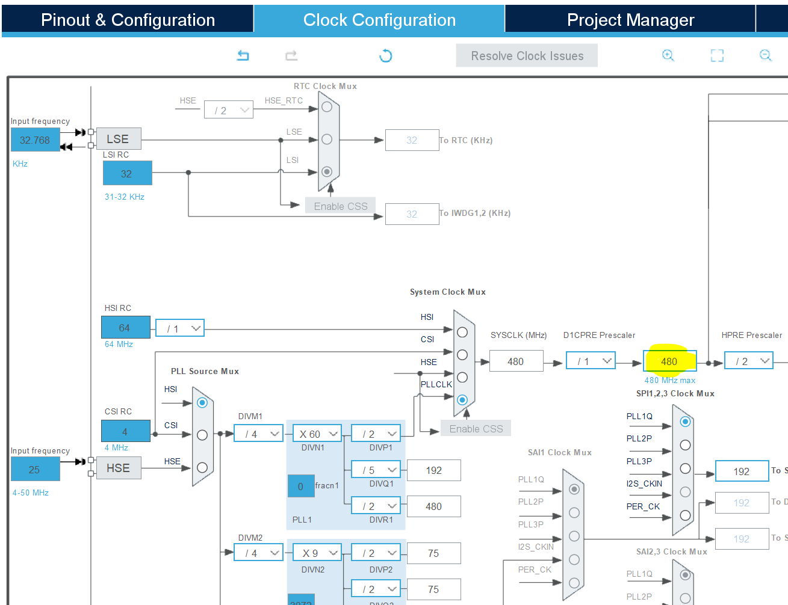

# How to run an STM32H755 Nucleo at 480MHz

###### This guide probably also works for other H7 boards, I have only tested it on the H755ZI-Q

## 

  Board SMPS/LDO firmware power configuration must match with the hardware configuration. 

 [Guide explaining how to fix if you bricked it](https://community.st.com/t5/stm32-mcus/how-to-unbrick-an-stm32h7-after-setting-the-wrong-power-mode/ta-p/49691)

## Walkthrough

1. Choose which power supply configuration you want to use. Either `Supply config 1: internal LDO only` or `Supply config 3: Internal SMPS and LDO cascaded` work. (I have not tested a bypass or external supply source). In the [user manual for the H7 Nucleo](https://www.st.com/resource/en/user_manual/um2408-stm32h7-nucleo144-boards-mb1363-stmicroelectronics.pdf) section 6.4.8 talks about the SMPS and LDO configuration.

2. Change the hardware to match the power configuration that you have chosen. Table 10 shows how the Nucleo hardware will need to be changed to accomplish this power configuration. I went with the `Supply config 3`. I have highlighted the components that will need to be changed from the default Nucleo setup from the factory. Dashes mean that the component needs to be removed and X's mean the component needs to be added. You can check the [BOM](https://www.st.com/resource/en/bill_of_materials/mb1363_bom.zip) to see what resistor values are needed, but in this case it is a zero ohm resistor, so you can move R35 to R34.

3. In CUBEMX (or manual register configuration), set the the SupplySource to either `PWR_SMPS_2V5_SUPPLIES_LDO`(config 3) or `PWR_LDO_SUPPLY`(config 1) depending on which supply config you selected. To run at 480MHz the power regulator voltage must be set to `Power Regulator Voltage Scale 0`.

4. Now you can set your clock configuration to 480MHz and it will not brick your hardware.

